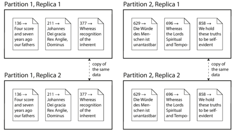

# Distributed Data

What happens if multiple machines are involved in storage and retreival of data? The are various reasons why you might want to ditribute a database across multiple machines:
- Scalability
- Fault tolerance/high availability
- Latency

### Scaling to higher load
The simplest approach is to buy a more powerful machine (vertical scaling or scaling up). 

The problem of this approach is that the cost grows faster than linearly: a machine with twice as many CPUs, twice as much RAM, and twice as much disk capacity as another typically costs signifcantly more than twice as much. And due, de bottlenecks, a machine twice the size cannot necessarily handle twice the load.

Also, may offer limmited fault tolerance and it is definitely limited to a single geographic location.

Another approach is the `shared-disk architecture`, where several machines with independent CPUs and RAM, but stores data on an array of disk that is shared between the machines. This architecture is used for some data warehousing workloads, but contention and overhead of locking limit the scalability of the shared-disk approach.

#### Shared-nothing Architectures
By contrast, `shared-nothing architectures`(horizontal scaling or scaling out) have gained a lot of popularity. Each machine or virtual machine running the database is called a node. Each node uses its CPUs, RAM and disk independently. Any coordination between nodes is done at the software level, using a conventional network.

You can potentially distribute data across multiple geographic regions, and with cloud deployments of virtual machines, even for small companies, a multi-region distributed architecture is now feasible. 

This architecture is not necessarily the best choice fore every use case, but requires the most caution from the application developer. He need to be aware of the constraints and trade-off that occur in such a distributed system. 

It usually incurs additional complexity for applications and sometimes limits the expressiveness of the data models you can use.

#### Replication Versus Partitioning
Two common ways data is distributed across multiple nodes:
- Replication: It provides redundancy. Can also help improve performance.
- Partitioning: Splitting a big database into smaller subsets called _partitions_ so that different partitions can be assigned to different nodes (also known as `sharding`)

