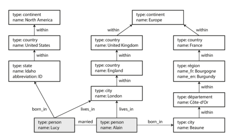

# 2. Data models and Query languages
Data models are perhaps the most important part of developing software, not only on how the software is written, but also on how we think about the problem that we are solving. 

Most applications are built by layering one data model on top of another. In a complex application there may be more intermediary levels, such as APIs built upon APIs, but the basic idea is still the same: each layer hides the complexity of the layers below it by providing a clean data model.

The data model has such a profound effect on what the software above it can and can’t do, so it’s important to choose one that is appropriate to the application.

## 2.1 Relational Model vs Document Model
The dominance of relational databases has lasted around 25‒30 years, and appears to solve use cases of `transaction processing` and `batch processing`.

As computers became vastly more powerful and networked, they started being used for increasingly diverse purposes. And remarkably, relational databases turned out to generalize very well, beyond their original scope of business data processing.

### NoSQL
NoSQL is the latest attempt to overthrow the relational model’s dominance. The name `NoSQL` is unfortunate, and t has been retroactively reinterpreted as `Not Only SQL`.

There are several driving forces behind the adoption of NoSQL databases:
- A need for greater scalability than relational databases
- A widespread preference for free and open source software.
- Specialized query operations that are not well supported by relational model
- A desire for a more dynamic and expressive data model.

### The object-relational mismatch
For applications developed in an object-oriented programming language, if data is stored in relational tables, an awkward translation layer is required. _Object-relational mappings (ORM)_ reduce the amount of boilerplate code required for this translation layer, but they can't completely hide the differences between the two models.

Some developers feel that the JSON model reduces the impedance mismatch between the application code and the storage layer. 

### Many-to-One and Many-to-Many Relationships
For these relationships, we have two options on a Document Database, save as a plain text and save an id to refer this field, saved in another document.

The advantage of using an ID is that because it has no meaning to humans, it never needs to change: the ID can remain the same, even if the information it identifies changes. Anything that is meaningful to humans may need to change sometime in the future. The problem is that you need to get human-meaningful information from another document.

If the database itself does not support joins, you have to emulate a join in application code by making multiple queries to the database, impacting in the code's complexity and in the application's performance.

### Relational Versus Document Databases Today
There are many differences to consider when comparing relational databases to document databases, including their fault-tolerance properties and handling of concurrency. Here we are talking about the differences in the data model.

- The document data model are schema flexibility, better performance due to locality, and that for some applications it is closer to the data structures used by the application. 
- The relational model counters by providing better support for joins, and many-to-one and many-to-many relationships
- The document model has limitations: for example, you cannot refer directly to a nested item within a document, but instead you need to say something like “the second item in the list of positions for user 251”, but for documents that are not too deeply nested, is not usually a problem.
- The poor support for joins in document databases may or may not be a problem, depending on the application.
    If your application does use many-to-many relationships, the document model becomes less appealing. It’s possible to reduce the need for joins by denormalizing, but then the application code needs to do additional work to keep the denormalized data consistent. 

### Schema flexibility in the document model
Document databases are sometimes called _schemaless_, but that’s misleading, as the code that reads the data usually assumes some kind of structure. A more accurate term is `schema-on-read`. It is similar to dynamic (runtime) type checking in programming languages.

where an application wants to change the format of its data, you would just start writing new documents with the new fields, and have code in the application handle with old and new `schema`.

In relational database you will need perform a _migration_ to achive. Schema changes have a bad reputation of being slow and requiring downtime. This reputation is not entirely deserved: most relational database systems execute the ALTER TABLE statement in a few milliseconds. 

In cases where all records are expected to have the same structure, schemas are a useful mechanism for documenting and enforcing that structure. 

### Data locality for queries

If your application often needs to access the entire document, there is a performance advantage to this _storage locality_. The locality advantage only applies if you need large parts of the document at the same time. 

On updates to a document, the entire document usually needs to be rewritten. It is generally recommended that you keep documents fairly small and avoid writes that increase the size of a document.

Some relational data models (Spanner, Oracle) are applying a kind of locality.

### Convergence of document and relational databases
Most relational database systems have supported XML and JSON. 

On the document database side, some databases (RethinkDB, MongoDB) supports relational-like joins in its query language.

If a database is able to handle document-like data and also perform relational queries on it, applications can use the combination of features that best fits their needs.

It seems likely that in the future, relational databases will continue to be used alongside a broad variety of nonrelational datastores, an idea that is sometimes called `polyglot persistence`.

## 2.2 Query Languages for data
SQL is a _declarative_ query language used to querying data in the relational models.
- An imperative language tells the computer to perform certain operations in a certain order. You can imagine stepping through the code line by line. 
- Otherwise, in a declarative query language  like SQL, you just specify the pattern of the data you want, but not how to achieve that goal. It is up to the database system’s query optimizer to decide which indexes and which join methods to use, and in which order to execute various parts of the query.
- A declarative query language is attractive because it is typically more concise and easier to work. It also hides implementation details of the database engine, which makes it possible for the database system to introduce performance improvements without requiring any changes to queries.
- Finally, declarative languages often lend themselves to parallel execution. Imperative code is very hard to parallelize across multiple cores and multiple machines, because it specifies instructions that must be performed in a particular order.

### MapReducing querying
`MapReduce` is a programming model for processing large amounts of data in bulk across many machines. A limited form of MapReduce is supported by some NoSQL datastores as a mechanism for performing read-only queries across many documents.

MapReduce is neither a declarative query language nor a fully imperative query API, but somewhere in between: the logic of the query is expressed with snippets of code, which are called repeatedly by the processing framework. It is based on the map (also known as collect) and reduce (also known as fold or inject) functions.

MapReduce is a fairly low-level programming model for distributed execution on a cluster of machines. Higher-level query languages like SQL can be implemented as a pipeline of MapReduce operations, but there are also many distributed implementations of SQL that don’t use MapReduce. Note there is nothing in SQL that constrains it to running on a single machine, and MapReduce doesn’t have a monopoly on distributed query execution.

A usability problem with MapReduce is that you have to write two carefully coordinated functions, which is often harder than writing a single query. Moreover, a declarative query language offers more opportunities for a query optimizer to improve the performance of a query.

## 2.3 Graph-like data models
if many-to-many relationships are very common in your data, the relational model can handle with simple cases, but as the connections within your data become more complex, it becomes more natural to start modeling your data as a graph.
- A graph consists of two kinds of objects: vertices (also known as nodes or entities) and edges (also known as relationships or arcs). Many kinds of data can be modeled as a graph.
- Well-known algorithms can operate on these graphs: for example, car navigation systems search for the shortest path between two points in a road network
- graphs are not limited to such homogeneous data: an equally powerful use of graphs is to provide a consistent way of storing completely different types of objects in a single datastore (Facebook)

Example:


There are several different ways of structuring and querying data in graphs. Mainly, the property graph model (implemented by Neo4j, Titan, and InfiniteGraph) and the triple-store model (implemented by Datomic, AllegroGraph, and others).

### Property graphs
each vertex consists of:
- A unique identifier
- A set of outgoing edges
- A set of incoming edges
- A collection of properties (key-value pairs)

Each edge consists of:
- A unique identifier
- The vertex at which the edge starts (the tail vertex)
- The vertex at which the edge ends (the head vertex)
- A label to describe the kind of relationship between the two vertices
- A collection of properties (key-value pairs)

> _Comparing with relational model_: You can think of a graph store as consisting of two relational tables, one for vertices and one for edges

You could imagine extending the graph to also include many other facts. Graphs are good for evolvability: as you add features to your application, a graph can easily be extended

#### The Cypher Query language
Cypher is a declarative query language for property graphs, created for the Neo4j graph database. When we use this language, we can easely tell to follow a chain of outgoing edges until match with some conditions. This language is ready to lead with these chain conditions and is natural on the query.

An example of query following the image before:
```SQL
    MATCH
    (person) -[:BORN_IN]->  () -[:WITHIN*0..]-> (us:Location {name:'United States'}),
    (person) -[:LIVES_IN]-> () -[:WITHIN*0..]-> (eu:Location {name:'Europe'})
    RETURN person.name
```

Here we are searching people who born in `United States` and live in `Europe`.

> _Comparing with relational model_: The graph data can be represented in a relational database. But if we put graph data in a relational structure, can we also query it using SQL? The answer is yes, but with some difficulty. The idea of variable-length traversal paths in a query can be expressed using something called recursive common table expressions (the `WITH RECURSIVE` syntax).

If the same query can be written in 4 lines in one query language but requires 29 lines in another, that just shows that different data models are designed to satisfy different use cases. It’s important to pick a data model that is suitable for your application.

### Triple-stores
The triple-store model is mostly equivalent to the property graph model, using different words to describe the same ideas. All information is stored in the form of very simple three-part statements: (subject, predicate, object). 

The subject of a triple is equivalent to a vertex in a graph. The object is one of two things:
- A value in a primitive datatype, such as a string or a number. In that case, the predicate and object of the triple are equivalent to the key and value of a property on the subject vertex.
- Another vertex in the graph. In that case, the predicate is an edge in the graph, the subject is the tail vertex, and the object is the head vertex. 

---
## Summary
Historically, data started out being represented as one big tree (the hierarchical model), but that wasn’t good for representing many-to-many relationships, so the relational model was invented to solve that problem. More recently, developers found that some applications don’t fit well in the relational model either. New nonrelational “NoSQL” datastores have diverged in two main directions:
- Document databases target use cases where data comes in self-contained documents and relationships between one document and another are rare.
- Graph databases go in the opposite direction, targeting use cases where anything is potentially related to everything.

All three models (document, relational, and graph) are widely used today, and each is good in its respective domain. One model can be emulated in terms of another model but the result is often awkward. 

Each data model comes with its own query language or framework, and we discussed several examples: SQL, MapReduce, MongoDB’s aggregation pipeline, Cypher, SPARQL, and Datalog.