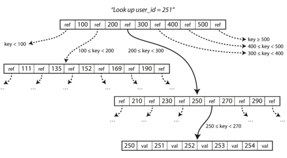
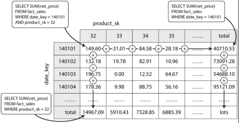

# 3. Storage and retrieval
Simplifiyng, a database needs to do two things: when you give it some data, it should store the data, and when you ask it again later, it should give the data back to you.

Why should you, as an application developer, care how the database handles storage and retrieval internally? You’re probably not going to implement your own storage engine from scratch, but you do need to select a storage engine that is appropriate for your application.

We will examine two families of storage engines: log-structured storage engines, and page-oriented storage engines such as B-trees.

## 3.1 Data structures that power your database
Many databases internally use a log, which is an append-only data file. Real databases have more issues to deal with, but the basic principle is the same. 

The write is very efficient, but the read, in algorithmic terms, the cost of a lookup is O(n): if you double the number of records n in your database, a lookup takes twice as long. That’s not good.

In order to efficiently find the value for a particular key in the database, we need a different data structure: an index. It is an _additional_ structure that is derived from the primary data. 

    Maintaining additional structures incurs overhead, especially on writes. Any kind of index usually slows down writes, because the index also needs to be updated every time data is written. This is an important trade-off in storage systems: well-chosen indexes speed up read queries, but every index slows down writes. For this reason, databases don’t usually index everything by default, but require you, without introducing more overhead than necessary.

### Hash indexes
Let’s say our data storage consists only of appending to a file, the simplest possible indexing strategy is this: keep an in-memory hash map where every key is mapped to a byte offset in the data file, the location at which the value can be found.

When you want to look up a value, use the hash map to find the offset in the data file, seek to that location, and read the value.

This may sound simplistic, but it is a viable approach (Bitcask uses on available RAM). This type of index is well suited to situations where the value for each key is updated frequently and there are not too many distinct keys. It's feasible to keep all keys in memory.

    When the log file grows, we start a new file and compact it, discarting old entries for the same keys. This process can happen in other thread and when finished, we deleted the old file and the old hash map and replaces for the new. Similar as this, we can do with more than one file and merge it. The result of this, we can look for a key in a few hash maps.

An append-only design turns out to be good for several reasons:
- Appending and segment merging are sequential write operations, which are generally much faster than random writes
- Concurrency and crash recovery are much simpler if segment files are append-only or immutable.
- Merging old segments avoids the problem of data files getting fragmented over time

However, the hash table index also has limitations:
- The hash table must fit in memory, so if you have a very large number of keys, you’re out of luck. In principle, you could maintain a hash map on disk, but unfortunately it is difficult to make an on-disk hash map perform well.
- Range queries are not efficent. You'd have to look up each key individually in the hash maps.

### SSTables and LSM-Trees
we can make a simple change to the format of our segment files: we require that the sequence of key-value pairs is sorted by key: We call this format `Sorted String Table`. They have several big advantages over log segments with hash indexes:
- Merging segments is simple and efficient. The approach is like the one used in the `mergesort algorithm`.  When multiple segments contain the same key, we can keep the value from the most recent segment and discard the values in older segments.
- In order to find a particular key in the file, you no longer need to keep an index of all the keys in memory. You still need an in-memory index to tell you the offsets for some of the keys, but it can be sparse: one key for every few kilobytes of segment file is sufficient, because a few kilobytes can be scanned very quickly.

But how do you get your data to be sorted by key in the first place? Maintaining a sorted structure in memory is easy! You can insert keys in any order and read them back in sorted order, working as follows:
- When a write comes in, add it to an in-memory balanced tree data structure. This in-memory tree is sometimes called a memtable.
- When the memtable gets bigger than some threshold—typically a few megabytes—write it out to disk as an SSTable file, and writes can continue to a new memtable instance.
- In order to serve a read request, first try to find the key in the memtable, then in the most recent on-disk segment, then in the next-older segment...
- From time to time, run a merging and compaction process in the background to combine segment files and to discard overwritten or deleted values.

It only suffers from one problem: if the database crashes, the most recent writes (which are in the memtable but not yet written out to disk) are lost. So, we can keep a separate log on disk to which every write is immediately appended. That log is not in sorted order, but that doesn’t matter, because its only purpose is to restore the memtable after a crash.

    This approach can be slow when looking up keys that do not exist in the database: you have to check the memtable, then the segments all the way back to the oldest before you can be sure that the key does not exist. In order to optimize this kind of access, storage engines often use additional "Bloom filters".

### B-trees
The log-structured indexes are gaining acceptance, but they are not the most common type of index. _B-tree_ remain the standard index implementation in almost all relational databases, and many nonrelational databases use them too.

They keep key-value pairs sorted by key, but that's where the similarity ends. B-trees break the database down into fixed-size blocks or pages, traditionally 4 KB in size (sometimes bigger), and read or write one page at a time. 

Each page can be identified using an address or location, which allows one page to refer to another:

One page is designated as the root of the B-tree; whenever you want to look up a key in the index, you start here.

It is assumed that the overwrite does not change the location of the page: This is in stark contrast to log-structured indexes, which only append to files.

    Some operations require several different pages to be overwritten. For example, if you split a page because an insertion caused it to be overfull, you need to write the two pages that were split, and also overwrite their parent page to update the references to the two child pages. This is a dangerous operation, because if the database crashes after only some of the pages have been written, you end up with a corrupted index. It is common for B-tree implementations to include an additional data structure on disk: a write-ahead log. This is used for recovery purpose.

### Comparing B-trees and LSM-Trees
B-tree implementations are generally more mature than LSM-tree implementations. In general, LSM-trees are typically faster for writes, whereas B-trees are thought to be faster for reads. However, benchmarks are often inconclusive and sensitive to details of the workload.
- **Advantages of LSM-Tree**: Both write every piece of data multiple times. This effect is known as _write amplification_ and in write-heavy applications has a direct performance in cost, because it uses the disk bandwith. LSM-trees are typically able to sustain higher write throughput than B-trees, because they sometimes have lower write amplification. LSM-trees can be compressed better, and thus often produce smaller files on disk than B-trees. B-tree storage engines leave some disk space unused due to fragmentation
- **Downsides of LSM-trees**: The compaction process can sometimes interfere with the performance of ongoing reads and writes. 
    - Disks have limited resources, so it can easily happen that a request needs to wait while the disk finishes an expensive compaction operation. 
    - The response time of queries to log-structured storage engines can sometimes be quite high, and B-trees can be more predictable.
    - If write throughput is high and compaction is not configured carefully, it can happen that compaction cannot keep up with the rate of incoming writes. SSTable-based storage engines do not throttle the rate of incoming writes, even if compaction cannot keep up, so you need explicit monitoring to detect this situation

An advantage of B-trees is that each key exists in exactly one place in the index. Thie make it attractive in databases that want to offer strong transactional semantics. Transaction isolation is implemented using locks on ranges of keys, and in a B-tree index, those locks can be directly attached to the tree

### Other indexing structures
Key-value indexes are like a primary key index in the relational model, that uniquely identifies one row in a relational table, or one document in a document database, or one vertex in a graph database.

It is also very common to have secondary indexes. They are often crucial for performing joins efficiently. A secondary index can easily be constructed from a key-value index. The main difference is that keys are not unique: many rows (documents, vertices) with the same key.

The value of the key-value pair could be the actual row or could be a reference to the row stored elsewhere. The place where rows are stored is known as a heap file. It avoids duplicating data when multiple secondary indexes are present. 

#### Clustured and covering index
In some situations, the extra hop from the index to the heap file is too much of a performance penalty for reads, so it can be desirable to store the indexed row directly within an index.  A compromise between a _clustered index_ (storing all row data within the index) and a _nonclustered index_ (storing only references to the data within the index) is known as a _covering index_ or _index with included columns_, which stores some of a table’s columns within the index.

Clustered and covering indexes can speed up reads, but they require additional storage and can add overhead on writes.

#### Multicolumn indexes
The single key-value index is not enough if we need to query multiple columns. The most common type of multi-column index is called a concatenated index, which simply combines several fields into one key by appending one column to another (the index definition specifies in which order the fields are concatenated).

Multi-dimensional indexes are a more general way of querying several columns at once, which is particularly important for geospatial data, and a standard B-tree or LSM-tree index is not able to answer that kind of query efficiently

One option is to translate a two-dimensional location into a single number using a space-filling curve, and then to use a regular B-tree index. More commonly, specialized spatial indexes such as R-trees are used. 

#### Full-text search and fuzzy indexes
All the indexes discussed don't allow you to do search for _similar keys_. For example, full-text search engines commonly allow a search for one word to be expanded to include synonyms of the word, to ignore grammatical variations of words, and to search for occurrences of words near each other in the same document.

Lucene is able to search text for words within a certain edit distance (an edit distance of 1 means that one letter has been added, removed, or replaced)

#### Keeping everything in memory
These structures have been answers to the limitations of the disks. Data on disk needs to be laid out carefully if you want good performance on reads and writes. Disks have two significant advantages: 
- They are durable (their contents are not lost if the power is turned off)
- They have a lower cost per gigabyte than RAM.
Of course, as RAM becomes cheaper, the cost-per-gigabyte argument is eroded. 

 This has led to the development of in-memory databases.

Some in-memory key-value stores, such as Memcached, are intended for caching use only, where it’s acceptable for data to be lost if a machine is restarted. These databases aim for durability, writing a log of changes to disk, by writing periodic snapshots to disk, or by replicating the in-memory state to other machines.

Counterintuitively, the performance advantage of in-memory databases is not due to the fact that they don’t need to read from disk. They can be faster because they can avoid the overheads of encoding in-memory data structures in a form that can be written to disk.

## 3.2 Transaction processing and analytics

Even though databases started being used for many different kinds of data, the basic access pattern remained similar to processing business transactions. 
    Note: A transaction needn’t necessarily have ACID (atomicity, consistency, isolation, and durability) properties. Transaction processing just means allowing clients to make low-latency reads and writes.

However, databases also started being increasingly used for data analytics, which has very different access patterns. Usually an analytic query needs to scan over a huge number of records, only reading a few columns per record, and calculates aggregate statistics (such as count, sum, or average) rather than returning the raw data to the user. 

These queries help the management of a company make better decisions (business intelligence). In order to differentiate this pattern of using databases from transaction processing, it has been called _online analytic processing (OLAP)_ 

| Property | Transaction processing systems (OLTP) | Analytic systems (OLAP) |
|---|---|---|
| Main read pattern | Small number of records per query, fetched by key |Aggregate over large number of records |
|Main write pattern|Random-access, low-latency writes from user input|Bulk import (ETL) or event stream|
|Primarily used by|End user/customer, via web application|Internal analyst, for decision support|
|What data represents|Latest state of data (current point in time)|History of events that happened over time|
|Dataset size|Gigabytes to terabytes|Terabytes to petabytes|

### Data warehousing
A data warehouse is a separate database that analysts can query to their hearts’ content, without affecting OLTP operation.It contains a read-only copy of the data in all the various OLTP systems in the company, and is extracted (using either a periodic data dump or a continuous stream of updates), transformed into an analysis-friendly schema, cleaned up, and then loaded into the data warehouse. This process is known as `Extract–Transform–Load (ETL)`

A big advantage of using a separate data warehouse is that the data warehouse can be optimized for analytic access patterns.
- The data model of a data warehouse is most commonly relational, because SQL is generally a good fit for analytic queries. 
- Look similar on the surface, the internals of the systems can look quite different, because they are optimized for very different query patterns.

    Some vendors: Comercial licences Teradata, Vertica, SAP HANA, and ParAccel (Amazon RedShift is a hosted version of ParAccel). Open source SQL-on-Hadoop projets Apache Hive, Spark SQL, Cloudera Impala, Facebook Presto, Apache Tajo, and Apache Drill

#### Stars and Snowflakes: Schemas for Analytics
IKn analytics, there is much less diversity of data models. Many data warehouses are used in a fairly formulaic style, known as a `star schema`.
- At the center of the schema is a so-called `fact table`. Represents an envent that occurred at a particular time.
- Other columns in the fact table are foreign key references to other tables, called `dimension tables`. As each row in the fact table represents an event, the dimensions represent the _who, what, where, when, how, and why_ of the event. (Even date and time are often represented using dimension tables, because this allows additional information about dates, such as public holidays)
- A variation of this template is known as the `snowflake schema`, where dimensions are broken down into subdimensions. 
- Snowflake schemas are more normalized than star schemas, but star schemas are often preferred because they are simpler for analysts to work with
- Tables are often very wide: fact tables often have over 100 columns, sometimes several hundred.

### Column-oriented Storage
If you have trillions of rows and petabytes of data in your fact tables, storing and querying them efficiently becomes a challenging problem. 

In most OLTP databases, storage is laid out in a `row-oriented` fashion: all the values from one row of a table are stored next to each other. Document databases are similar.

The idea behind `column-oriented storage` is simple: don’t store all the values from one row together, but store all the values from each column together instead. If each column is stored in a separate file, a query only needs to read and parse those columns that are used in that query, which can save a lot of work.

    Column storage is easiest to understand in a relational data model, but it applies equally to nonrelational data.

For data warehouse queries that need to scan over millions of rows, a big bottleneck is the bandwidth for getting data from disk into memory. Besides reducing the volume of data that needs to be loaded from disk, column-oriented storage layouts are also good for making efficient use of CPU cycles. 

#### Sort Order in column storage
In a column store, it doesn’t necessarily matter in which order the rows are stored. However, we can choose to impose an order, like we did with SSTables. _Note that it wouldn’t make sense to sort each column independently._

The data needs to be sorted an entire row at a time, even though it is stored by column. For example, if queries often target date ranges, such as the last month, it might make sense to make date_key the first sort key. Then the query optimizer can scan only the rows from the last month, which will be much faster than scanning all rows.

A second column can determine the sort order of any rows that have the same value in the first column. That will help queries that need to group or filter 

Another advantage of sorted order is that it can help with compression of columns, because after sorting, it will have long sequences where the same value is repeated many times in a row.

    That compression effect is strongest on the first sort key. The second and third sort keys will be more jumbled up, and thus not have such long runs of repeated values. 

#### Several different sort orders

Different queries benefit from different sort orders, so why not store the same data sorted in several different ways? 

Data needs to be replicated to multiple machines anyway, so that you don’t lose data if one machine fails. You might as well store that redundant data sorted in different ways so that when you’re processing a query, you can use the version that best fits the query pattern.

### Aggregation: Data cubes
Not every data warehouse is necessarily a column store. However, columnar storage can be significantly faster for ad hoc analytical queries, so it is rapidly gaining popularity

Data warehouse queries often involve an aggregate function, such as COUNT, SUM, AVG, MIN, or MAX in SQL. If the same aggregates are used by many different queries. Why not cache some of the counts or sums that queries use most often?

One way of creating such a cache is a `materialized view`. A materialized view is an actual copy of the query results, written to disk, whereas a virtual view is just a shortcut for writing queries. 

A common special case of a materialized view is known as a `data cube` or `OLAP cube`. It is a grid of aggregates grouped by different dimensions. 

In general, facts often have more than two dimensions. It’s a lot harder to imagine what a five-dimensional hypercube would look like, but the principle remains the same. These values can then repeatedly be summarized along each of the dimensions.

- The advantage is that certain queries become very fast because they have effectively been precomputed. 
- The disadvantage is that a data cube doesn’t have the same flexibility as querying the raw data. For example, there is no way of calculating which proportion of sales comes from items that cost more than $100, because the price isn’t one of the dimensions.

---

## Summary

On a high level, we saw that storage engines fall into two broad categories: those optimized for transaction processing (OLTP), and those optimized for analytics (OLAP). There are big differences between the access patterns in those use cases:
- OLTP systems are typically user-facing, which means that they may see a huge volume of requests. In order to handle the load, applications usually only touch a small number of records in each query. The application requests records using some kind of key, and the storage engine uses an index to find the data for the requested key. Disk seek time is often the bottleneck here.
- Data warehouses and similar analytic systems are less well known, because they are primarily used by business analysts, not by end users. They handle a much lower volume of queries than OLTP systems, but each query is typically very demanding, requiring many millions of records to be scanned in a short time. Disk bandwidth (not seek time) is often the bottleneck here, and column-oriented storage is an increasingly popular solution for this kind of workload.

On the OLTP side, we saw storage engines from two main schools of thought:
- The log-structured school, which only permits appending to files and deleting obsolete files, but never updates a file that has been written. Bitcask, SSTables, LSM-trees, LevelDB, Cassandra, HBase, Lucene, and others belong to this group.
- The update-in-place school, which treats the disk as a set of fixed-size pages that can be overwritten. B-trees are the biggest example of this philosophy, being used in all major relational databases and also many nonrelational ones.

As an application developer, if you’re armed with this knowledge about the internals of storage engines, you are in a much better position to know which tool is best suited for your particular application. If you need to adjust a database’s tuning parameters, this understanding allows you to imagine what effect a higher or a lower value may have.