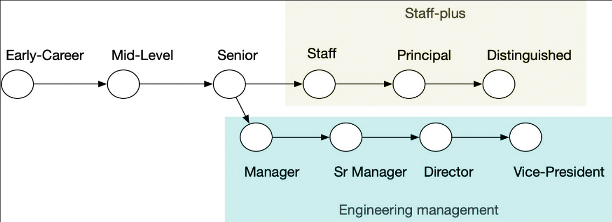

# 1.Overview
Companies have a two-track software engineering career path. Engineering management is the first track, and the second is technical leadership

It uses the term Staff-plus as an overarching label for Staff, Principal, and Distinguished titles, but many companies only have a subset of these titles.

## Staff engineers archetypes

The four common archetypes of Staff-plus roles are:

- The **Tech Lead** guides the approach and execution of a particular team. They partner closely with a single manager, but sometimes they partner with two or three managers within a focused area.
- The **Architect** is responsible for the direction, quality, and approach within a critical area. They combine in-depth knowledge of technical constraints, user needs, and organization level leadership.
- The **Solver** digs deep into arbitrarily complex problems and finds an appropriate path forward. Some focus on a given area for long periods. Others bounce from hotspot to hotspot as guided by organizational leadership.
- The **Right Hand** extends an executive's attention, borrowing their scope and authority to operate particularly complex organizations.

    `You'll find non-Staff engineers acting with the behaviors of every archetype. Being a Staff-engineer is not just a role. It's the intersection of the role, your behaviors, your impact, and the organization's recognition of all those things.`

### Tech lead

Tech Leads are the most common Staff archetype and lead one team or a cluster of teams in their approach and execution. 
- They're comfortable scoping complex tasks, coordinating their team towards solving them, and unblocking them along the way.
- They're a close partner to the team's product manager.
- While they're coding less, they are still the person defining their team's technical vision, and stepping in to build alignment within the team on complex issues.
- Tends to develop early on within companies that have a strong concept of team.
- The day-to-day work of a Tech Lead is most similar to the work you'd already be doing as a Senior engineer, making it a fairly intuitive transition.

The Tech Lead role is, for many folks, their __first experience as a Staff engineer__.

Some companies use Tech Lead as a title, and others use it as a role. The Tech Lead is one approach to operating as a Staff engineer, but it's quite common to perform the Tech Lead role without having the impact expected of a Staff-level engineer.

### Architect

The Architect title has fallen out of style in many companies, but the Architect role remains alive and well for folks operating at Staff-plus levels. 
- They are responsible for the success of a specific technical domain (for example, the company's API design, frontend stack, storage strategy, or cloud infrastructure)
- Mantain an intimate understanding of the business' needs, their users' goals, and the relevant technical constraints.
- Some companies push for Architects to remain deep in the codebase, others set a clear expectation that Architects must not write code: both models work for some companies.

        There is a toxic preconception that Architects design systems in isolation and then pass their designs to others to implement, and unfortunately that does happen in some cases.

### Solver

The Solver is a trusted agent of the organization who goes deep into knotty problems, continuing to work on them until they're resolved.
- Generally operates on problems that are already identified as organizational priorities
- They generally stop working on problems once they're contained, requiring a soft touch to avoid infuriating the teams left behind to maintain the “solved” problem.
- The Solver is most common in companies that think of individuals, rather than teams, as the atomic unit of planning and ownership.

### Right hand

The Right Hand is the least common of the archetypes.
- He is akin to operating as a senior organizational leader without direct managerial responsibilities.
- Borrowing authority comes with the obligation of remaining deeply aligned with that leader's approach, beliefs, and values.
- Problems addressed at this level are never purely technical and instead involve the intersection of the business, technology, people, culture, and process.
- Often dive into a fire, edit the approach, delegate execution, and then pop over to the next fire.

The joy of these roles is that you only work on essential problems. The tragedy is that you're always on to the next issue by the time those problems are solved.

---

Success in these roles requires remaining engaged; it's essential to understand what kinds of work energize you. The `Tech Lead` and `Architect` tend to work with the same people on the same problems for years. The `Solver` and `Right Hand` bounce from fire to fire and they're tightly aligned with executive priorities.

For each archetype, you'll find folks who love it and find it deeply rewarding.

## What do Staff engineers actually do?
The responsibilities of a Staff-plus engineer can change over time. Still, usually, their main focus is working on projects/efforts that have strategic value for the company while driving technical design and up-leveling their team.

Staff engineers keep doing much of what made them successful as Senior engineers: building relationships, writing software, coordinating projects.

Staff engineers do those same tasks than as senior engin eer, but whereas previously they were the core of their work, now they're auxiliary tasks.

**Shared foundation across all archetypes**: setting and editing technical direction, providing sponsorship and mentorship, injecting engineering context into organizational decisions, exploration

### Setting technical direction
Staff engineers speak for their companies' technology. Technology cannot speak for itself and requires effective advocates. 

Some Staff-plus engineers are explicitly hired to lead a specific area such as API design, and in other cases, they find themselves editing and aligning approaches across a broad area.

Setting technical direction is far more about `understanding and solving` the real needs of the organization around you and far less about prioritizing technology and approaches that you personally are excited to learn about

### Mentorship and sponsorship

There's a popular vision of heroic leadership, but you're far more likely to change your company's long-term trajectory by growing the engineers around you than through personal heroics. The best way is mentorship and sponsorship.

Mentorship is one of the most valuable activities in a Staff-plus role

### Providing engineering perspective

Staff-plus engineers are the folks who will often get unexpectedly pulled into the room where this sort of decision is happening.

These brief moments of input on critical decisions are unduly impactful and will allow you to inject an engineering perspective where it would otherwise be missed. Just remember that you're representing the interests of all of engineering, not just your own.

### Exploration

In the long-term, companies either learn to explore, or they fade away; this isn't an ignorable challenge. Simply assigning a team that's mastered hill-climbing to do exploratory work is far from a sure thing, so many companies take a different approach. They find a couple of trusted individuals with broad skills, allocate some resources, and check back in a few months later to see what they've discovered. One of those engineers is often a Staff engineer.

This isn't always a business problem either:  It might be reducing your infrastructure costs or identifying a multi-region strategy.

This is some of the most rewarding and the riskiest work companies do.

### But will you still write software?
The answer is, of course, it depends!  

- It was important to ensure that my technical strategy (and other macro-level decision–making) was informed by the on–the–ground experiences of the rest of my team.
- The more senior you get, the less your job is about code, the more your job becomes about mentoring and growing the people around you.
- Most write some, some write none, but none write as much as they used to earlier in their career. 
- Even if you're not writing much, you'll be reading a ton of your coworkers' code and doing a fair number of code reviews.

### Slow but rewarding

Early in your career, it's easy to get attached to software development's quick feedback cycle, `write, test, ship, repeat`. These longer timeframes can feel surprisingly demoralizing when you first take on a Staff-plus role.

## Does the title even matter?

The three consistent advantages that generally come with a Staff-plus title are:
- Allowing you to bypass informal gauges of seniority.
- Facilitating access to "the room"
- Increase in current and career compensation.

### Informal gauges of seniority

Many technology companies describe themselves as pursuing meritocracy.  While these gauges are believed to evaluate ideas objectively, their sheer informality becomes a broad vector of bias and often conflate confidence with competence.

A Staff-plus title allows you to reinvest the energy you’ve previously spent on proving yourself

### Being in the room

In more senior roles, you’re often in the right place to provide input when it’s relatively cheap to incorporate, where otherwise your feedback might not be incorporated.

### Compensation

Most companies introduce compensation bands for each role by the time they reach one to two hundred folks. Those compensation bands will generally ensure your compensation increases along with the role.

### Access to interesting work

The believe id the role will give them access to the most visible or exciting work. That’s true to some extent, but it depends on the Staff archetypes.

The most consistently effective way to get access to interesting work is being hired to do it

### Different rather than better
Even if you love the privileges and perks of a Staff-plus title, it’s important to recognize that they come on the back of a very different job. Many folks find that their Staff role’s heightened expectations eliminate the work that used to excite them.

