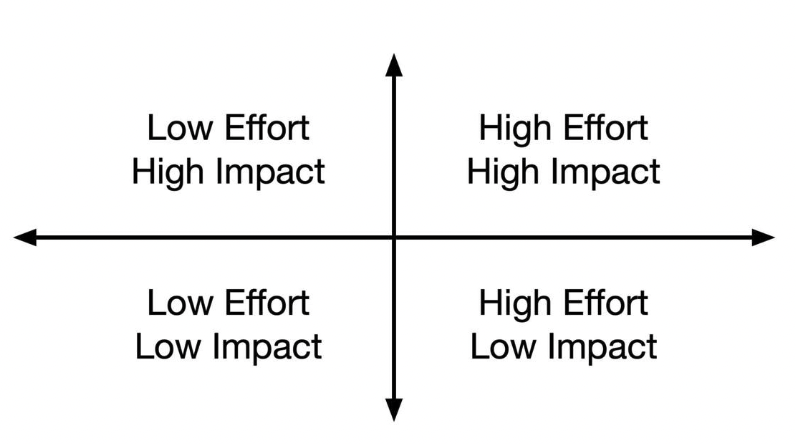

# 2. Operating at Staff

Many engineers become focused on the Staff-plus career path because the engineering manager path has too many meetings or requires too much collaboration with other coworkers, and are you going to be surprised if you begin a Staff-plus with that mindset.

Part of the challenge is that much of the work you’re doing has a much slower feedback cycle.
- **Work on what matters** to make the most of the working hours you have
- **Write an engineering strategy** to guide your organization’s approach to supporting your company’s business objectives
- **Curate technical quality** to maintain the quality of your company’s architecture and software
- **Stay aligned with authority** to remain an effective leader over time. Technical leadership roles rely on proxied authority from another (usually, managerial) leader
- **To lead, you have to follow**, it’s also essential to learn to blend your vision with the visions from your peers and leadership.
- **Learn to never be wrong**, learn to collaborate with folks with different priorities and perspectives
- **Create space for others** so that your team grows stronger than your contribution.
- **Build a network of peers** to vet difficult decisions and to give you honest feedback

> These won’t cover everything you do. At times you’ll find your role surprisingly similar to that of an engineering director, and at other times strangely familiar to previous work in your career.

---

## Work on what matters
Even for the most career-focuses, time to do your work will become increasingly scarce as you get deeper into your career. The expectations around your impact will keep growing: Senior roles require that you accomplish more and more and do it in less and less time.

### Avoid snacking
Avoid “snacking” when they prioritize work.

"Snacking" is choose easy and `low-impact` tasks. These snacks give a sense of accomplishment, but others are likely equally capable of completing them (and for some of them, it might be a good development opportunity)

Yet, it’s ok to spend some of your time on snacks to keep yourself motivated, but if you’re not deliberately tracking your work, it’s easy to catch yourself doing little to no high-impact work.

### Stop preening
Preening is a subset of "snaking": it is doing `low-impact, high-visibility` work

Unfortunately, it’s not uncommon to see some companies’ senior-most engineers spend the majority of their time doing work that’s of dubious value, but that is frequently recognized in company meetings.

To be a successful preener requires near invulnerability to criticism of your actual impact, and your true work will suffer if your energy is diverted to preening.

### Stop chasing ghost
Some would assume that companies, rational optimizers that they are, avoid spending much time on low-impact high-effort projects. Unfortunately, that isn’t consistently the case.

You have to maintain a hold on your ego to avoid investing in meaningless work on a grand scale

### Existential issues
Exploring whether your company is experiencing an existential risk. Try to balance future success against surviving until that future becomes the present. If you’re about to lose one of those rounds, then always focus there.

> Not every existential issue is financial, like Twitter’s fail whale stability challenges

The most effective places to work are those that matter to your company but still have enough room to actually do work, when the organization is incapable of paying attention to, usually because its leadership doesn’t value that work.

It's true that at some point, though, you’ll find that the work needs support, and it’s quite challenging to get support for work that a company is built to ignore or devalue.

Sometimes an area that an organization doesn’t pay attention to is so important that you’re going to want to advocate for it to start paying attention.

### Foster growth
Growing the team arround you, hiring, onboarding, mentoring, and coaching are wholly neglected at many companies.

### Edit
A surprising number of projects are one small change away from succeeding, one quick modification away from unlocking a new opportunity, or one conversation away from consensus. 

You can often shift a project’s outcomes by investing the smallest ounce of effort

It’s particularly valuable because it’s quick, it’s easy, it’s highly motivating for both you and the person you help, and it’s hugely impactful when done well.

### Finish things

We only get value from finishing projects, and getting a project over the finish line is the magical moment it goes from risk to leverage. Time spent getting work finished is always time well spent.

### What only you can

The sort of work that simply won’t happen if you don’t do it. This work is an intersection of what you’re exceptionally good at and what you genuinely care about.

These are your biggest opportunity to work on something that matters.

### Why it matters

You can’t escape subjective interview practices, but you can deliberately accumulate expertise from doing valuable work. Indeed, that’s the only viable long-term bet on your career.

---

## Writing engineering strategy

The reality is that good engineering strategy is boring and that it’s easier to write an effective strategy than a bad one.

Durably useful engineering strategy and vision are the output of iterative, bottom-up organizational learning.

### When and why
Strategies are tools of proactive alignment that empower teams to move quickly and with confidence. Strategies allow everyone –not just the empowered few– to make quick, confident decisions that might have otherwise cost them a week of discussion.

> If you realize that you’ve rehashed the same discussion three or four times, it’s time to write a strategy.

### Write five design docs

Design documents describe the decisions and tradeoffs you’ve made in specific projects. Your company might call them RFCs

A good design document describes a specific problem, surveys possible solutions, and explains the selected approach’s details.

> Be specific:  It’s easy for two well-meaning engineers on the same team to interpret an abstract strategy in different ways, but it’s much harder to stay misaligned when you’re implementing a specific solution.

- **Start from the problem.** The clearer the problem statement, the more obvious the solutions
- **Keep the template simple.** Most companies have a design document template, which is a great pattern to follow. However, those templates are often expanded to serve too many goals. _Prefer minimal design document templates_
- **Gather and review together, write alone.** It’s very unlikely that you personally have all the relevant context to write the best design document on a given topic. Before getting far into the process, collect input from folks with relevant perspectives. However, be skeptical of carrying that collaborative process into writing the design document itself. _Gather perspectives widely but write alone._
- **Prefer good over perfect.** It’s better to write a good document and get it in front of others than it is to delay for something marginally better.

It takes a lot of practice to write great design documents. If you want to improve yours, my best advice is to reread your designs after you’ve finished implementing them

### Synthesize those five design docs into a strategy

After your organization has written five design documents, sit down and read them all together. Look for controversial decisions that came up in multiple designs, particularly those that were hard to agree on.

Good strategies guide tradeoffs and explain the rationale behind that guidance. Bad strategies state a policy without explanation, which decouples them from the context they were made.

- **Start where you are**. Working on strategy, it’s easy to be paralyzed by the inherently vast ambiguity we work in, but you’ve just got to dive in and start writing. _Where you are now is always the best place to start._
- **Write the specifics.** Write until you start to generalize, and then stop writing
- **Be opinionated.** Good strategies are opinionated.
- **Show your work.**  You must show the rationale behind your opinions. Make it possible for others to modify and extend your work as the undelying context shifts

### Extrapolate five strategies into a vision

As you collect more strategies, it’ll become increasingly challenging to reason about how the various strategies interact.

Take five of your recent strategies, extrapolate how their tradeoffs will play out over the next two to three years. As you edit through the contradictions and weave the threads together, you’ve written an engineering vision. The final version will give you calls a robust belief in the future.

- **Write two to three years out.** Companies, organizations, and technology all change quickly enough that thinking too far into the future is fraught. It also doesn’t work if you write a vision that expires in six months
- **Ground in your business and your users.** Effective visions ground themselves in serving your users and your business. It keeps the vision aligned with your leadership team’s core values–users and business
- **Be optimistic rather than audacious.** Visions should be ambitious, but they shouldn’t be audacious. Don’t write what you think would be possible with infinite resources.
- **Stay concrete and specific.** Visions get more useful as they get more specific. Be a bit more detailed than you’re comfortable with.
- **Keep it one to two pages long.** The reality is that most people don’t read long documents. Force yourself to write something compact, and reference extra context by linking to other documents

---

## Managing technical quality
The common wise is there’s a crisis of technical quality. Our engineers aren’t prioritizing quality, and we need to hire better engineers or retrain the ones we have.  _It’s both unhelpful and wrong_

In most cases, low technical quality isn’t a crisis; it’s the expected, normal state. At a well-run and successful company, most of your previous technical decisions won’t meet your current quality threshold.

### The problem 
Your goal is to maintain an appropriate technical quality level while devoting as much energy as possible towards the core business.
- fix the hot spots that are causing immediate problems
- adopt best practices that are known to improve quality
- prioritize leverage points that preserve quality as your software changes
- align technical vectors in how your organization changes software
- measure technical quality to guide deeper investment
- spin up a technical quality team to create systems and tools for quality
- run a quality program to measure, track and create accountability

It’s generally most effective to start with the lightest weight solutions. 
Even if it doesn’t work, you’ll learn more and more quickly from failing to roll out the easy stuff

### Best practices

In theory, organizations would benefit from adopting best practices before fixing quality hot spots, but I recommend practices after hot spotting. Adopting best practices requires a level of organizational and leadership maturity that takes some time to develop.

> A good process is evolved rather than mandated. A rushed process is a failed process.

Equally important is the idea of limiting concurrent process rollouts. If you try to get teams to adopt multiple new practices simultaneously, you’re fighting for their attention with yourself. It also makes it harder to attribute impact

Adopting a single new practice at a time also forces you to think carefully about which to prioritize.

### Leverage points

Optimization works well for the issues you already have, but it’s intentionally inapplicable to the future 

> the worst sin of performance engineering is applying effort to unproven problems.

However, as you look at how software changes over time, there are a small handful of places where extra investment preserves quality over time, both by preventing gross quality failures and reducing the cost of future quality investments.

One of the hidden powers of investing in leverage points is that you don’t need total organizational alignment to do it.

### Technical vectors
Aligning technical vectors:
- Give direct feedback
- Refine your engineering strategy
- Encapsulate your approach in your workflows and toolings: Deliberate tools create workflows that nurture habits far better than training and documentation.
- Train new team members during their onboarding: You get folks pointed in the right direction when they join.
- Use Conway’s Law, that argues that organizations build software that reflects their structure
- Curate technology change using architecture reviews, investment strategies, and a structured process for adopting new tools.

### Measure technical quality
How do you measure your codebase’s quality such that you can identify gaps, propose a plan of action, and evaluate the impact of your efforts to improve?

It is possible to usefully measure code quality, and it comes down to developing an extremely precise definition of quality. Consider, for instance:
- What percentage of the code is statically typed?
- How many files have associated tests?
- What is test coverage within your codebase?
- How narrow are the public interfaces across modules?
- What percentage of files use the preferred HTTP library?
- Do endpoints respond to requests within 500ms after a cold start?
- How many functions have dangerous read-after-write behavior? Or perform unnecessary reads against the primary database instance?
- How many endpoints perform all state mutation within a single transaction?
- How many functions acquire low-granularity locks?
- How many hot files exist which are changed in more than half of pull requests?

> You’re welcome to disagree: your definition should be specific to your codebase and your needs.

### Technical quality team

A technical quality team is a software engineering team dedicated to creating quality in your codebase. The team’s goal is to create and preserve quality across your company’s software.

> This is not what’s sometimes called a quality assurance team. The technical quality team has a broader remit from workflow to build to test to interface design.

It’s rare for these teams to have a product manager, generally one-or-more Staff-plus engineers, and the engineering manager partner to fill that role.
- Trust metrics over intuition.
- Keep your intuition fresh. Team embedding and team rotations are the best way to keep your instincts relevant
- Listen to and learn from your users. If you’re not doing user research on your tools, then you are doomed as a quality investment team.
- Do fewer things, but do them better. Doing the few most important things will contribute more than many mediocre projects
- Don’t hoard impact. 

>  It’s important to establish a thoughtful approach that balances the benefits of exploration against the benefits of standardization.

### Quality program

Initiative led by a dedicated team to maintain technical quality across an organization.  Core approach is: